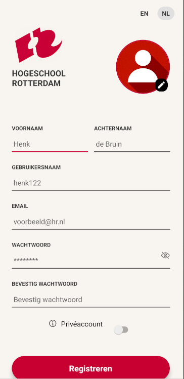
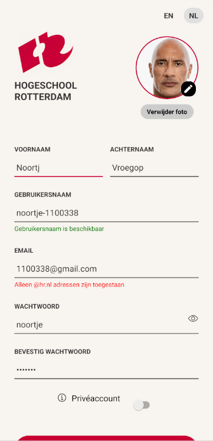
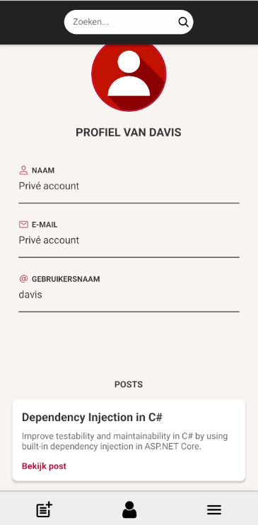
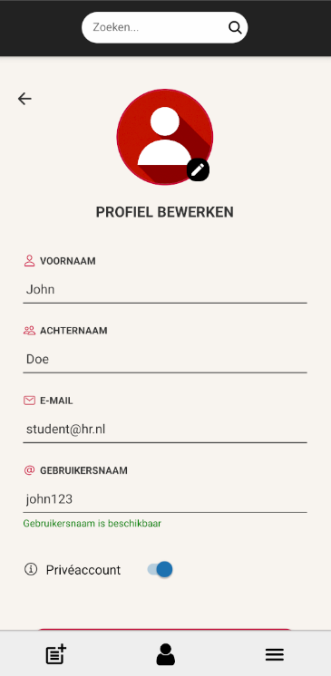
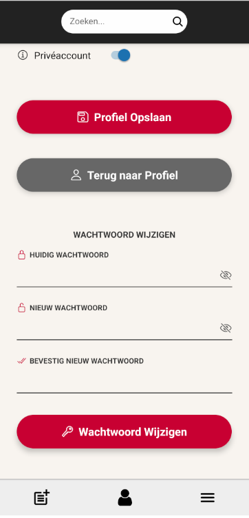
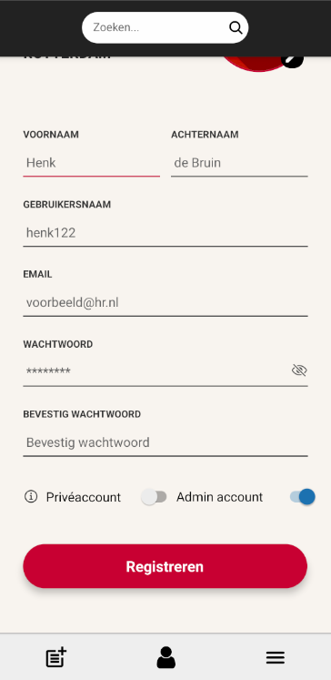

# RACademic Bronnendeling App

## Overzicht

De RACademic Bronnendeling App is een platform voor Hogeschool Rotterdam-studenten om studiematerialen zoals video’s, boeken en cursussen te delen en te vinden. Inloggen vereist een @hr.nl e-mail. Gebruikers kunnen bronnen delen, bekijken, beoordelen, favorieten en zoeken met filters. De app, gebouwd met React Native en Docker, werkt als website en mobiele app, met focus op veiligheid en gebruiksvriendelijkheid.

## Wie zijn wij?

Wij zijn team **Kiwi** en ons team bestaat uit:

- **Max Hofman** (1103166)
- **Tuwi Nannings** (0808374)
- **Noortje Vroegop** (1100338)
- **Jesper Edeling** (1103541)

---

# Installatie met Docker

1. Installatie programma's
   - Download en installeer Docker Desktop https://www.docker.com/products/docker-desktop/ voor jouw besturingssysteem en zorg dat het draait.
   - Download en installeer NodeJS https://nodejs.org/en
   - Download en installeer NPM https://www.npmjs.com/
   - Installeer de Expo Go app op android of ios via de playstore

2. Clone de repository:
   ```bash
   git clone https://github.com/Rac-Software-Development/wp4-2025-react-1d2-kiwi-wip.git
   cd wp4-2025-react-1d2-kiwi-wip
   ```
3. Bouw en start de app:
  ```bash
  docker-compose up --build -d
  ```

Wacht toch het installeren klaar is, dit kan even duren.

4. Ga naar de root van de react client folder
  ```bash
  cd .\react_client\
  ```

5. Installeer de packages met:
  ```bash
  npm install --legacy-peer-deps
  ```

6. Start de dev omgeving met
  ```bash
  npx expo start
  ```

Wacht tot je "Logs for your project will appear below. " ziet en scroll iets naar boven.
Scan de qr code met je telefoon en de website zal te zien zijn op je telefoon.
Of druk op W en de app opent zich in de browser.
(zorg dat je telefoon op dezelfde netwerk is verbonden als je pc)

Troubleshoot:
Krijg je problemen met packages probeer dit
  ```bash
  npm install --force
  ```
En start opnieuw:
  ```bash
  npx expo start
  ```


# Installatie zonder Docker
### 1. Software en versievereisten
Installeer en run alles van stap 1 van, installatie met docker.

- **Python-versie:** 3.x
- **Git**
- **Flask** 
- **React** 


### 2. Benodigde Python-packages
Je kunt deze afhankelijkheden installeren met behulp van het meegeleverde `requirements.txt`-bestand.
Of gebruik deze lijst om ze zelfs te installeren:
```bash
bcrypt==4.3.0
blinker==1.9.0
click==8.1.8
colorama==0.4.6
Flask==3.1.0
flask-cors==5.0.1
itsdangerous==2.2.0
Jinja2==3.1.6
MarkupSafe==3.0.2
Werkzeug==3.1.3
flask_jwt_extended
flask_cors
```

### 1. Clone de repository
Om te beginnen, clonen we de repository naar je lokale machine. Gebruik de volgende opdracht:

```bash
git clone https://github.com/Rac-Software-Development/wp4-2025-react-1d2-kiwi-wip.git
cd wp4-2025-react-1d2-kiwi-wip
```

### 2. Maak een virtual environment (venv) aan
Het gebruik van een virtual environment is aanbevolen om afhankelijkheden van dit project afzonderlijk te houden. Je kunt een virtual environment aanmaken via de **command line** of via **PyCharm**. Kies de methode die je wilt gebruiken.

#### Optie 1: Command Line
1. Maak een virtual environment aan:
   ```bash
   python -m venv venv
   ```
2. Activeer de virtual environment:
    
   - Op Windows (Git Bash):
     ```bash
     source venv/Scripts/activate
     ```

   - Op Windows (Command Prompt (CMD)):
     ```bash
     venv\Scripts\activate
     ```
   - Op macOS/Linux:
     ```bash
     source venv/bin/activate
     ```

### 3. Installeer afhankelijkheden

#### Installeren met `requirements.txt`
Zorg ervoor dat je virtual environment is geactiveerd. Installeer daarna de afhankelijkheden met:
```bash
pip install -r requirements.txt
```

### 4. Omgevingsvariabele Instellen
Om de Flask-applicatie te starten met `main.py` als de hoofdapplicatie, moet je de `FLASK_APP`-omgevingsvariabele instellen. Gebruik de onderstaande commando's, afhankelijk van je besturingssysteem:

#### macOS/Linux
```bash
export FLASK_APP=main.py
```

#### Windows (Command Prompt - CMD)
```bash
set FLASK_APP=main.py
```

#### Windows (Git Bash)
```bash
export FLASK_APP=main.py
```

### 5. Start de flask server

1. Navigeer naar de server map:
   ```bash
   cd .\flask_server\
   ```
2. Start de applicatie:
   ```bash
   flask --app main.py run
   ```
De flask server is nu toegankelijk via [http://127.0.0.1:5000](http://127.0.0.1:5000).

### 6. Start de React Client

1. Ga naar de root van de react client folder
  ```bash
  cd .\react_client\
  ```
2. Installeer de packages met:
  ```bash
  npm install --legacy-peer-deps
  ```
3. Start de dev omgeving met:
  ```bash
  npx expo start
  ```

Wacht to je "Logs for your project will appear below. "
Druk op W en je browser laat de website zien of scan de QR code voor de mobile web versie.

---

## ERD


1. users – Bevat informatie over gebruikers, zoals id, email, display_name, first_name, last_name, password, is_admin, is_public, en is_banned.
2. badges – Bevat gegevens over badges, zoals id, title, requirement, en image_url.
3. user_badges – Koppelt gebruikers aan badges met user_id en badge_id.
4. posts – Bevat details over posts, zoals id, title, content, user_id, total_rating, en posted_date.
5. comments – Bevat informatie over comments, zoals id, title, content, user_id, post_id, total_rating, en posted_date.
6. ratings – Registreert ratings, zoals user_id, post_id, comment_id, rating, is_favorited, is_reported, en report_reason.
7. post_tags – Koppelt posts aan tags met post_id en tag_id.
8. tags – Bevat gegevens over tags, zoals id, title, en color.

---

## Inloggegevens

Je kunt inloggen met het standaard account:

_Student_\
**Gebruikersnaam:** student@hr.nl\
**Wachtwoord:** 1

_Admin_\
**Gebruikersnaam:** admin@hr.nl\
**Wachtwoord:** 1

Bij het inloggen kun je ook de taal van de pagina wijzigen naar Engels of Nederlands, afhankelijk van je voorkeur.

---

### Registratiepagina

Op de **Registratiepagina** kunt u een account aanmaken als **Student**. U kunt kiezen in welke taal u de registratiepagina wilt zien: Engels of Nederlands. Tijdens het registratieproces wordt u gevraagd om persoonlijke gegevens in te vullen, zoals uw voornaam, achternaam, gebruikersnaam, e-mailadres (een @hr.nl-adres is verplicht) en wachtwoord. U kunt ook een profielfoto toevoegen (dit is niet verplicht) en aangeven of uw account openbaar of privé moet zijn.

---

## Navbar


- **Zoekbalk**  
  In de zoekbalk kun je zoeken naar woorden in de posttitels of de inhoud van posts.

- **Tag-selectie voor zoekopdracht**  
  Hier selecteer je de tags die je wilt gebruiken voor de zoekopdracht.

- **Zoekopdracht uitvoeren**  
  Gebruikt de ingevoerde tekst en de geselecteerde tags om te zoeken naar posts en navigeert naar de postpagina.

- **Profielknop**  
  Bezoek de profielpagina.

- **Sidebarknop**  
  Opent de sidebar.

- **Uitlogknop**  
  Logt uit en gaat terug naar de inlogpagina.

---

## Sidebar


- **Sidebar inklappen**  
  Deze knop klapt de sidebar terug in.

- **Pagina-knoppen**  
  Als je op deze knoppen klikt, bezoek je de pagina’s die aan de knoppen gekoppeld zijn.

- **Uitloggen**  
  Logt uit en gaat terug naar de inlogpagina.

---

## Post Overzicht Pagina


- **Tag-knoppen**  
  Bezoek de pagina die gelinkt is aan deze specifieke tag.

- **Edit post-knop**  
  Bewerk de post als jij de eigenaar bent.

- **Upvote**  
  Geef de post een positieve beoordeling.

- **Downvote**  
  Geef de post een negatieve beoordeling.

- **Favoriteren**  
  Voeg deze post toe aan je favorieten.

---

### Create Post pagina

Op de create post pagina kan je een post aanmaken. Tijdens het aanmaken van de post worden om deze gegevens gevraagt.

- **Post data**:
  - Titel
  - Content dus de bron zelf
  - en een tag zodat andere mensen de post makkelijker kunnen vinden

---

### Create tag pagina

Op de create tag pagina kan je een nieuwe tag aanmaken. Tijdens het aanmaken van de tag worden om deze gegevens gevraagt.

- **Tag data**:
  - De naam van de tag
  - De kleur van de tag

---

### Eigen post pagina

Op de eigen post pagina kan je alle posts zien die jij hebt gemaakt en kan je de details zien van de post en kan je de post aan passen

---

### Profiel bekijken

Op de profielpagina zie je een overzicht van persoonlijke gegevens, zoals naam, e-mailadres, gebruikersnaam en profielfoto. Daarnaast kun je ook badges en geplaatste posts bekijken, en zien of het account privé of openbaar is. Je kunt niet alleen je eigen profiel bekijken, maar ook de profielen van andere studenten. Als je je eigen profiel bekijkt, zie je bovendien een knop **Bewerken** om je gegevens aan te passen.

---

### Profiel bewerken

Via de profielpagina kun je je gegevens zelf aanpassen. Je kunt je naam, e-mailadres, gebruikersnaam en wachtwoord wijzigen. Ook kun je je profielfoto bijwerken of verwijderen en zelf instellen of je account privé of openbaar is.

## Overzicht

### Admin Functies

- Inloggen voor admins
- Gebruikers blokkeren
- Admin-accounts toevoegen (moet @hr.nl email gebruiken)
- Emails blokkeren

### Student Functies

- Inloggen (vereist @hr.nl email)
- Registreren (geblokkeerde emails kunnen niet opnieuw worden gebruikt)

### Gebruiker Functies

- Profiel bijwerken
- Bronnenoverzicht bijwerken
- Bron details bekijken
- Bronnen beoordelen
- Bronnen filteren
- Bronnen toevoegen als favoriet
- Bronnen zoeken
- Display-naam aanpassen
- Wachtwoord aanpassen

### Algemene Functies

- Inloggen vereist om content in de app te bekijken
- Bronnen bevatten tags

---

## **Screenshots**

|
**Profiel** | **Overzicht gebruikers** | **Badge popup** | **Overzicht bronnen** |
| ------------------------------------------------------------------------------------------------------- | ------------------------------------------------------------------------------------------------------- | ------------------------------------------------------------------------------------------------------- | ------------------------------------------------------------------------------------------------------- |
|  |  |  |  |
| **Inlog pagina** | **Nieuwe tag** | **Profiel bewerken** | **Nieuwe bron toevoegen** |
|  |  |  |  |

| **Registratie**                                                | **Registratie (2)**                                              | **Profielpagina anderen**                                 |
| -------------------------------------------------------------- | ---------------------------------------------------------------- | --------------------------------------------------------- |
|  |  |  |

| **Profiel bewerken**                                            | **Wachtwoord wijzigen**                                       | **Admin registratie**                                          |
| --------------------------------------------------------------- | ------------------------------------------------------------- | -------------------------------------------------------------- |
|  |  |  |

---

## **Code Bronnen**

- [React useState](https://www.w3schools.com/react/react_usestate.asp)
- [React useEffect](https://www.w3schools.com/react/react_useeffect.asp)
- [Object.prototype.toString()](https://developer.mozilla.org/en-US/docs/Web/JavaScript/Reference/Global_Objects/Object/toString)
- [Expo Router Notation](https://docs.expo.dev/router/basics/notation/#indextsx-files)
- [The Only Docker Tutorial You Need To Get Started](https://www.youtube.com/watch?v=DQdB7wFEygo) (The Coding Sloth)
- [How to Create a Flask + React Project](https://youtu.be/7LNl2JlZKHA?si=NaK5iTT8ocxOhwPi) (Arpan Neupane)
- [Marked - Markdown Parser](https://www.npmjs.com/package/marked)
- [datetime - Basic Date and Time Types](https://docs.python.org/3/library/datetime.html)
- [Resourceful Routing](https://flask-restful.readthedocs.io/en/latest/quickstart.html#resourceful-routing)
- [Bruno - The Open Source API Client](https://docs.usebruno.com/send-requests/overview)
- [SQLite string contains other string query](https://stackoverflow.com/questions/3498844/sqlite-string-contains-other-string-query)
- [React Native tutorial #53 Post API with Input fields and form data](https://www.youtube.com/watch?v=BJNOceFLdjQ) (Code Step By Step)
- [#1 Create a Simple Login Screen in React Native](https://www.youtube.com/watch?v=lA_73_-n-V4) (WithFrame)
- [Handle multiple checkboxes in expo react native](https://stackoverflow.com/questions/65205428/handle-multiple-checkboxes-in-expo-react-native)
- [Checkbox](https://docs.expo.dev/versions/latest/sdk/checkbox/)
- [Checkbox Inputs ( Buttons ) in React Native](https://www.youtube.com/watch?v=C-PVg6HhMNk) (ToThePointCode)
- [Password And Confirm Password Validation in React JS](https://youtu.be/HPmklyuk4Hc?si=zFx3tpyaEviE3vsl) (Time To Program)
- [ImagePicker](https://docs.expo.dev/versions/latest/sdk/imagepicker/)
- [ChatGPT - Like Dislike Buttons RN](https://chatgpt.com/share/68160223-38fc-800e-b129-fecd90a793de)
- [Passing Props to a Component – React](https://react.dev/learn/passing-props-to-a-component)
- [Storing Images in Your Database with Base64 & React](https://medium.com/@blturner3527/storing-images-in-your-database-with-base64-react-682f5f3921c2)
- [Upgrade Expo SDK](https://docs.expo.dev/workflow/upgrading-expo-sdk-walkthrough/)
- [Check if email address valid or not in Python](https://www.geeksforgeeks.org/check-if-email-address-valid-or-not-in-python/)
- [Navigating between pages](https://docs.expo.dev/router/basics/navigation/)
- [Learn Expo Router - Complete Tutorial](https://www.youtube.com/watch?v=Z20nUdAUGmM) (Cosden Solutions)
- [Router](https://docs.expo.dev/versions/latest/sdk/router/#hooks)
- [How to pass props to the screens when using expo router](https://stackoverflow.com/questions/78057797/how-to-pass-props-to-the-screens-when-using-expo-router)
- [Updating Arrays in State – React](https://react.dev/learn/updating-arrays-in-state)
- [Modal · React Native](https://reactnative.dev/docs/modal)
- [How To Authentication users with Token in a React application](https://medium.com/better-programming/how-to-authentication-users-with-token-in-a-react-application-f99997c2ee9d)
- [How to pass an array of numbers with TypeScript and React](https://stackoverflow.com/questions/62917259/how-to-pass-an-array-of-numbers-with-typescript-and-react)
- [React useState Append to Array](https://www.dhiwise.com/post/react-usestate-append-to-array-a-simple-guide)
- [Platform-Specific Code · React Native](https://reactnative.dev/docs/platform-specific-code)
